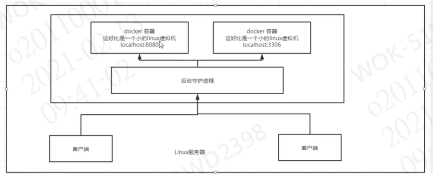
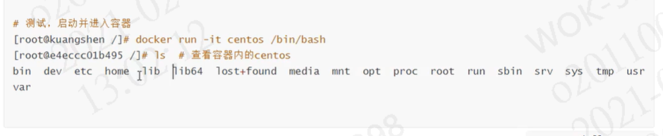
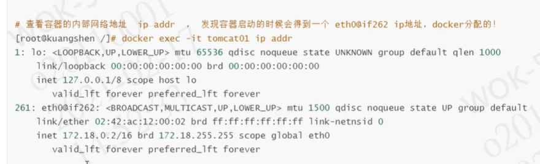

### Docker的安装

以centos7为例

```powershell
#1、删除旧文档
yum remove docker \
                  docker-client \
                  docker-client-latest \
                  docker-common \
                  docker-latest \
                  docker-latest-logrotate \
                  docker-logrotate \
                  docker-engine
#2、需要的安装包
yum install -y yum-utils

#3、设置镜像的仓库
yum-config-manager \
    --add-repo \ https://download.docker.com/linux/centos/docker-ce.repo  #默认是从国外的
  yum-config-manager 
  --add-repo http://mirrors.aliyun.com/docker-ce/linux/centos/docker-ce.repo #阿里云
 
 #更新yum软件包索引
 yum makecache faster
 
 #4、安装docker相关的依赖  docker-ce社区版  ee企业版
 yum install docker-ce docker-ce-cli containerd.io
 
 #5、启动docker
 systemctl start docker
 #6、验证是否安装成功
 docker version  
 #7、测试helloworld程序
 docker run hello-world
 #8、查看镜像
 docker images
 
 ##卸载docker
 #1、卸载依赖
 yum remove docker-ce docker-ce-cli containerd.io
 #2、删除资源
 rm -rf /var/lib/docker  # rm -rf /var/lib/docker  #dcker的默认工作目录
```

### 阿里云镜像加速

1、登陆阿里云 找到容器服务（容器镜像服务）      

2、找到镜像加速地址

CentOS的配置方式略微复杂，需要先将默认的配置文件（/lib/systemd/system/docker.service）复制到/etc/systemd/system/docker.service。然后再将加速器地址添加到配置文件的启动命令中，之后重启Docker即可。

```shell
sudo cp -n /lib/systemd/system/docker.service /etc/systemd/system/docker.service

sudo sed -i "s|ExecStart=/usr/bin/docker 

daemon|ExecStart=/usr/bin/docker daemon --registry-mirror=<your accelerate address>|g" /etc/systemd/system/docker.service
sudo sed -i "s|ExecStart=/usr/bin/dockerd|ExecStart=/usr/bin/dockerd --registry-mirror=<your accelerate address>|g" /etc/systemd/system/docker.service

sudo systemctl daemon-reload

sudo service docker restart  
```

3、配置使用


**##运行流程图：**


### Docker的工作原理

Docker是一个Client-Server结构的系统，Docker的守护进程运行在主机上。通过Socket从客户端访问。DockerServer接收到DockerClient的指令就会执行这个命令。



Docker为什么比VM快？

1、Docker有着比虚拟机更少的抽象层

2、Docker利用的是宿主机的内核，VM需要的是Guest OS


So：新建一个容器的时候，Docker不需要像虚拟机一样重新加载一个操作系统内核，避免引导，虚拟机是加载Guest OS，分钟级别的，而Docker是利用宿主机的操作系统，省略了这个复杂的过程，秒级！

### Docker的常用命令

#### 帮助命令：

``````shell
docker version #显示版本信息
docker info    #显示系统信息
docker  --help #帮助命令
``````

帮助文档的地址：https://docs.docker.com/reference/

#### 镜像命令：

`````shell
docker images ##查看所有本地主机上的镜像


#可选项
--all , -a		#列出所有镜像
--quiet , -q	#只显示镜像的id
`````

docker search 搜索镜像

```shell
docker search mysql

#可选项 
#例：通过收藏来过滤
--filter=STARS=3000
--filter , -f		Filter output based on conditions provided
--format		Pretty-print search using a Go template
--limit	25	Max number of search results
--no-trunc		Don't truncate output
```

docker pull  下载镜像

```shell
#docker pull 镜像名[:tag]
docker pull mysql  #如果不写tag默认下载最新版本
#指定版本下载
docker pull mysql:5.7
```


#### 容器命令：

有了镜像才可以创建容器，以centos为例，先下载centos镜像

```shell
docker pull centos
```


```shell
#新建容器并启动
docker run [可选参数] image
#参数说明
--name="name" #容器名字，区分容器
-d            #后台方式运行
-it           #使用交互方式运行，进入容器查看内容
-p            #指定容器的端口 -P 8080:8080
   -p ip: 主机端口：容器端口
   -p 主机端口：容器端口
   -p 容器端口
   容器端口
-P            #随机指定端口
```



退出容器

```shell
docker rm 容器id  #删除指定的容器  不能删除正在运行的容器
docker rm -f $(docker ps -aq) #删除所有的容器
docker ps -a -q|xargs docker rm #删除所有的容器 linux命令
```

启动和停止容器的操作

```shell
docker start 容器id  #启动指定的容器
docker restart 容器id #重新启动指定的容器
docker stop 容器id #停止当前容器
docker kill 容器id #强制停止当前容器
```

#### 常用的其他命令

后台启动容器

```shell
docker run -d 镜像名
docker run -d centos
##问题 docker ps 发现centos停止了
#常见的坑 docker容器使用后台运行，就必须要有一个前台进程，docker发现没有应用，就会自动停止

```

查看日志信息

```shell
docker logs -f -t --tail 容器id 

```


查看容器中进程信息

```shell
docker top 容器id 
```


查看容器的元数据

```shell
docker inspect 容器id
```


进入当前正在运行的容器

```shell
#我们通常容器都是使用后台方式运行的，需要进入容器，修改配置
方式1、docker exec -it 容器id /bin/bash
方式2、docker attach 容器id


#docker exec 进入容器后开启一个新的终端，可以在里面操作
#docker attach 进入容器当前正在执行的终端 不会启动新的进程
```

从容器内拷贝文件到主机上

```shell
docker cp 容器id:容器内路径 目的的主机路径
```


#### 小结


练习    docker安装nginx

```shell

docker search nginx
docker pull nginx
```


端口暴露的概念：


#### 可视化


**什么是portainer？**

 Portainer是Docker的图形化管理工具，提供状态显示面板、应用模板快速部署、容器镜像网络数据卷的基本操作（包括上传下载镜像，创建容器等操作）、事件日志显示、容器控制台操作、Swarm集群和服务等集中管理和操作、登录用户管理和控制等功能。

```shell
#Docker安装portainer
docker run -d -p 9000:9000 --restart=always --name portainer -v /var/run/docker.sock:/var/run/docker.sock --privileged=true portainer/portainer
```

​        访问测试：ip:8088

**Portainer展示：**

-  首页

​    包含docker-compose、容器、镜像、卷、网络总体概况。


- 容器

​    包含容器的启、停，新增，监控，日志查看，容器控制台等功能。


- 镜像

   包含镜像详细查看、删除、导入、导出等功能。


- 节点管理


### Docker镜像


至于容器如何获取镜像层文件而又不影响到是镜像层的呢？docker是这样实现的？
==如果需要获取某个文件，那么容器曾会从上到下去下一层的镜像层去获取文件，如果该层文件不存在，那么就会去下一镜像层去寻找，直到最后一层。
对于用户而言，用户面向的是一个叠加后的文件系统。==


而任何对于文件的操作都会记录在容器层，例如说修改文件，容器层会把在镜像层找到的文件拷贝到容器层然后进行修改，删除文件则会在容器层内记录删除文件的记录。


测试：

```shell
#启动默认的tomcat  没有webapps 官方镜像的原因，默认webapps底下是没有文件的
#自己拷贝进去基本的文件  
cp -r webapps.dist/* webapps   
#将操作过的文件commit为一个镜像  以后使用修改过的镜像即可
docker commit -a="" -m="" id  name 
```


### 容器数据卷

#### 	容器数据卷是什么？

​	==Docker原理回顾：把应用和环境打包成一个镜像。==

如果数据保存在容器中，容器一删除就没了。==新需求：数据可以持久化   例如mysql==

容器之间可以有一个共享技术！Docker中产生的数据同步到本地。

这就是卷技术！说白了就是目录的挂载，将容器内的目录挂载到linux上面


==一句话总结：容器的持久化和同步操作。容器间也是可以数据共享的。==


#### 使用数据卷

> 方式一：使用docker命令挂载   -v

```shell
docker run -it -v  主机目录：容器内目录
#测试
docker run -it -v /home/ceshi:/home centos /bin/bash  #把容器内home 文件下的内容同步挂载到linux系统的home下的ceshi
#启动起来可以通过docker inspect 容器id查看  如图:
```


测试文件的同步：


#### 实战：安装mysql

https://hub.docker.com/

```shell
docker search mysql 
docker pull mysql:5.7
#运行容器  需要进行数据挂载  安装mysql是需要配置密码的  要注意！
#官方测试
 docker run --name some-mysql -v /my/custom:/etc/mysql/conf.d -e MYSQL_ROOT_PASSWORD=my-secret-pw -d mysql:tag
 
#启动我们的
docker run -d -p 3310:3306 -v /home/mysql/conf:/etc/mysql/conf.d -v /home/mysql/data:/var/lib/mysql -e MYSQL_ROOT_PASSWORD=123456 --name mysql01 mysql:5.7
-d 后台运行
-p 端口映射
-v 卷挂载
-e 环境配置
--name 容器名字

```


#### 具名挂载   匿名挂载

```shell
#匿名挂载
-v 容器内路径
docker run -d -P --name nginx01 -v /ect/nginx nginx 
#查看所有卷的情况
docker volume ls 
#这里发现数据如图 ：这就是匿名挂载 -v只写了容器内的路径  没有写容器外的路径
```


```shell
#具名挂载 
docker run -d -P --name nginx01 -v juming-nginx:/ect/nginx nginx 
#通过-v  卷名：容器内路径
#查看这个卷
docker volume inspect juming-nginx
```


==所有docker容器内的卷，没有指定目录的情况下都是在`/var/lib/docker/volumes`下==

通过具名挂载可以方便找到我们的一个卷，推荐使用。

```shell
#如何确定是具名挂载还是匿名挂载，还是指定路径挂载？
-v 容器内路径   			#匿名挂载
-v 卷名：容器内路径 	  #具名挂载
-v /宿主机路径::容器内路径 #指定路径挂载
```

拓展：

```shell
#通过-v 容器内路径:ro rw改变读写权限
 ro  readonly  #只读
 rw  readwrite #可读可写
 #一旦设置里容器权限，容器对我们挂载出来的内容就有限定了
 docker run -d -P --name nginx01 -v juming-nginx:/ect/nginx:ro nginx 
 docker run -d -P --name nginx01 -v juming-nginx:/ect/nginx:rw nginx 
 #ro  说明这个路径只能通过宿主机来操作，容器内部无法操作
```

#### 初识Dockerfile

>DockerFile就是用来构建docker镜像的构建文件。命令脚本
>
>通过这个脚本可以生成脚本，镜像是一层一层的，一个脚本就是一个命令

方式二：

```shell
#创建一个dockerfile文件 名字随机  建议Dockerfile
#文件内容  指令大写
FROM centos
VOLUME ["volume01","volume02"]
CMD echo "---end---"
CMD /bin/bash
#这里的每个命令 就是镜像的一层

#docker build -f dockerfile1 -t kuangshen/centos .
```


#### 数据卷容器

> 多个mysql同步数据


### DockerFile

#### DockerFile介绍

DockerFile是用来构建docker镜像的文件，命令参数脚本。

构建步骤：

>1、编写一个DockerFile文件
>
>2、docker build 构建成为一个镜像
>
>3、docker run 运行镜像
>
>4、docker push 发布镜像(dockerhub、阿里云镜像仓库)


#### DockerFile构建过程

**基础知识：**

>1、每个保留关键字（指令）都必须是大写字母
>
>2、执行从上到下顺序执行
>
>3、#表示注释
>
>4、每个指令都会创建提交一个新的镜像层，并提交。


>DockerFile	   ：          构建文件，定义了一切的步骤，源代码
>
>DockerImages：          通过DockerFile构建生成的镜像，最终发布和运行的产品。
>
>Docker容器     ：          容器就是镜像运行起来提供服务器。

#### **DockerFile的指令**

```shell
FROM 		#基础镜像，一切从这里开始构建
MAINTAINER  #镜像是谁写的  姓名+邮箱
RUN 		#镜像构建的时候需要运行的命令
ADD 		#步骤 ：tomcat镜像  添加tomcat压缩包
WORKDIR  	#镜像的工作目录
VOLUME  	#挂载卷的目录
EXPOSE		#暴露端口位置
CMD			#指定这个容器启动的时候要运行的命令，只有最后一个会生效，可被替代
ENTRYPOINT  #指定这个容器启动的时候要运行的命令，可以追加命令
ONBUILD 	#当构建一个被继承DockerFile,这个时候会运行ONBUILD指令，触发指令
COPY		#类似ADD 将文件拷贝到镜像中
ENV			#构建的时候设置环境变量
```


#### 实战测试

==Docker Hub 99%镜像都是从这个基础镜像过来的 `FROM scratch,`然后配置需要的软件和配置来进行的构建==


1、编写DockerFile文件


> docker  history    #列出本地进行的变更历史


>CMD	 ENTRYPOINT的区别

```shell
CMD			#指定这个容器启动的时候要运行的命令，只有最后一个会生效，可被替代
ENTRYPOINT  #指定这个容器启动的时候要运行的命令，可以追加命令
```


DockerFile中 很多命令都很相似，需要了解它们的区别。

#### 实战：Tomcat镜像

1、准备镜像文件 Tomcat压缩包、jdk的压缩包


2、编写Dockerfile文件

```shell
vim Dockerfile    #创建并编辑
#内容#
FROM centos 
MAINTAINER wyh<99318277@qq.com>
COPY readme.txt /usr/local/readme.txt
ADD jdk-8u11-linux-x64.tar.gz /usr/local/ ##ADD添加的压缩包会自动解压
ADD apache-tomcat-9.0.22.tar.gz /usr/local/
RUN yum -y install vim
NEV MYPATH /usr/local
WORK $MYPATH
NEV JAVA_HOME /usr/local/jdk1.8.0_11
ENV CLASSPATH $JAVA_HOME/lib/dt.jar:$JAVA_HOME/lib/tools.jar
ENV CATALINA_HOME /usr/local/apache-tomcat-9.0.22
ENV CATALINA_BASH /usr/local/apache-tomcat-9.0.22
ENV PATH $PATH:JAVA_HOME/bin:$CATALINA_HOME/lib:$CATALINA_HOME/bin
EXPOSE 8080
CMD /usr/local/apache-tomcat-9.0.22/bin/startup.sh && tail -F /url/local/apache-tomcat-9.0.22/bin/logs/catalina.out
```

3、构建镜像

```shell
##构建镜像
`docker build -t diytomcat .`
```

4、启动镜像

```shell
docker run -d -p 9090:8080 --name wyhtomcat -v /home/wyh/build/tomcat/test:/usr/local/apache-tomcat-9.0.22/webapps/test -v /home/wyh/build/tomcat/tomcatelogs/:/usr/local/apache-tomcat-9.0.22/webapps/logs diytomcat 
```

5、访问测试

6、发布项目（由于做了挂载  在本地发布即可）

```shell
cd WEB-INF/
vim web.xml
vim index.jsp

```

```xml
<?xml version="1.0" encoding="UTF-8"?>
<web-app xmlns:xsi="http://www.w3.org/2001/XMLSchema-instance" xmlns="http://java.sun.com/xml/ns/javaee" xmlns:web="http://java.sun.com/xml/ns/javaee/web-app_2_5.xsd" xsi:schemaLocation="http://java.sun.com/xml/ns/javaee http://java.sun.com/xml/ns/javaee/web-app_2_5.xsd" id="WebApp_ID" version="2.5">
<display-name>db</display-name>
 <welcome-file-list>
   <welcome-file>index.html</welcome-file>
    <welcome-file>index.jsp</welcome-file>
  </welcome-file-list>
</web-app>
```

```xml
<%@ page language="java" contentType="text/html; charset=UTF-8"
    pageEncoding="UTF-8"%>
<!DOCTYPE html>
<html>
<head>
<meta charset="utf-8">
<title>hello   diytomcat</title>
</head>
<body>
Hello World!<br/>
<%
System.out.println("----test   logs ----");
%>
</body>
</html>
```


#### 发布自己的镜像

> DockerHub

1、地址：https://hub.docker.com/  注册账号

2、确定账号可以登录

3、在服务器上提交自己的镜像


```shell
#登录
docker login -u wyh

```

4、提交镜像 docker push

```shell
docker push wyh/diytomcat:1.0   #作者+版本号
```


解决问题：

```shell
docker tag id 镜像名:[tag] #指定版本号
```


> 阿里云镜像服务上      参考官方

1、登录阿里云 找到容器镜像服务

2、创建命名空间


3、创建容器镜像


4、浏览


#### 小结


### Docker网络

理解Docker0


```shell
##docker 是怎么处理网络访问的？？
```

```shell
docker run -d -P --name tomcat01 tomcat

#查看容器的内部网络地址
docker exec -it tomcat01 ip addr
```




