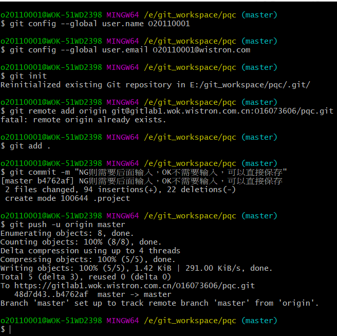
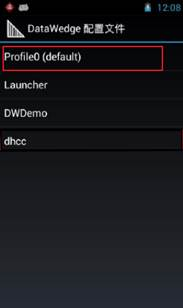
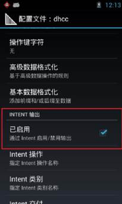
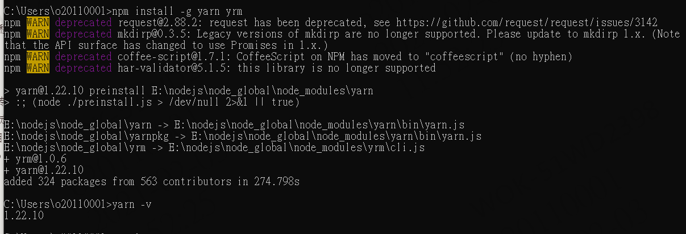
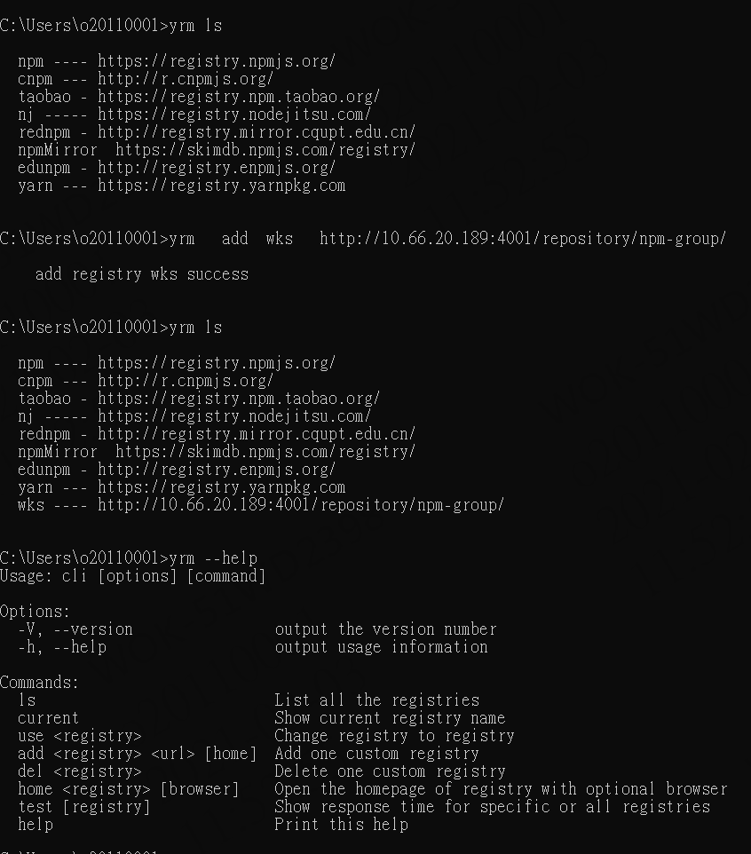

### SQL代码：

###设置主键自增从1开始

```
TRUNCATE TABLE 表名
```

####条件查询  条件显示：

```sql
select  form_id,(CASE WHEN file_type = 'O' THEN '外來文件' when file_type='G' then '技術文件' ELSE 'ISO文件' END) || '-' ||  (case when file_name is null then '' else file_name end)  as form_name,
            (case when router_stage2 = '0' then '新增'
                    when router_stage2 = '1' then '變更' else '作廢' end)as form_type,
             (case  when router_stage = '0' then '開立'
                    when router_stage = '1' then '送簽中'
                    when router_stage = '2' then '結案'
                    else '作廢' end) as form_state,
            create_user as form_employ,create_date as form_date
        from flow_system.flow_maintain_isofiles
```


### cmd方式结束进程

​		1、查看进程

```
netstat -ano | findstr 8080
```


​		2、结束进程

​	

```
	taskkill /F /PID 15716
```


### app重新打包  

1、到10.57.30.111上

打开hbuilderX

发行-云打包

生成安卓证书（需要有jre的环境）

==使用keytool -genkey命令生成证书：==

```
keytool -genkey -alias patrol -keyalg RSA -keysize 2048 -validity 36500 -keystore patrol.keystore
```


testalias是证书别名，可修改为自己想设置的字符，建议使用英文字母和数字
test.keystore是证书文件名称，可修改为自己想设置的文件名称，也可以指定完整文件路径

查看证书信息：

```
keytool -list -v -keystore test.keystore  
```


云打包配置：

**1>证书别名：生成证书时使用-alias参数设置的证书别名；
2>私钥密码：生成证书时使用的keystore密码；
3>证书文件：生成证书时使用-keystore参数设置的证书保存路径；**

**打包完成自动返回下载地址，点击链接下载APP安装

2、到10.57.30.102上

放C:\02.Website\API\TMP 文件夹里 改名PQC.apk

### PQC下载

[‎2021/‎1/‎26 下午 04:58] Mango W Wang/WOK/Wistron: 

http://10.57.30.102:801/download.html  PQC下载链接 " Download PQC"选项

 

### git提交代码

```shell
Command line instructions
You can also upload existing files from your computer using the instructions below.


Git global setup
git config --global user.name "Mango W Wang"
git config --global user.email "o20110001@wistron.com"

Create a new repository
git clone git@gitlab1.wok.wistron.com.cn:O20110001/e-pratol.git
cd e-pratol
touch README.md
git add README.md
git commit -m "add README"
git push -u origin master

Push an existing folder
cd existing_folder
git init
git remote add origin git@github.com:wyh136136/notes.git
git add .
git commit -m "Initial commit"
git push -u origin master

Push an existing Git repository
cd existing_repo
git remote rename origin old-origin
git remote add origin git@gitlab1.wok.wistron.com.cn:O20110001/e-pratol.git
git push -u origin --all
git push -u origin --tags
```


鼠标右键打开git bash here:
<1>输入git config --global [user.name](http://user.name/) “你的用户名”
<2>输入git config --global user.email “你的邮箱”
<3>输入git init
<4>输入git remote add origin 你刚才建立的项目连接

```
<5>输入git add .
<6>输入git commit -m “注释”
```

<7>输入git config http.postBuffer 524288000 (特别提醒: 此行是在本地设置缓存, 有些项目文件较大, 使用http无法上传,可设置此命令)

```
<8>输入git push -u origin master 将代码推送到gitlab端
```



```
git remote add origin https://github.com/wyh136136/spingcloud2021.git
git branch -M master
git push -u origin master
git config --system http.sslcainfo "E:/Git/mingw64/ssl/certs/ca-bundle.crt"  
```

```css
##angular更改单独模块的样式

:host ::ng-deep{
  .ant-table-thead>tr>th {
    color: white;
    /* font-weight: bolder; */
    background: #143f8d;
    border-bottom: 1px solid #e8e8e8;
    -webkit-transition: background 0.3s ease;
    transition: background 0.3s ease;
  }
      a {
        color: #190996;
        text-decoration: none;
      }
     
}
#####angular自定义样式

```


相同点：在启动类上面添加 @EnableDiscoveryClient、@EnableEurekaClient 这二个注解作用，都可以让该服务注册到注册中心上去。

不同点：@EnableEurekaClient 只支持Eureka注册中心，@EnableDiscoveryClient 支持Eureka、Zookeeper、Consul 这三个注册中心。


### postgresql日期转换

```
函数	                      返回类型	          描述	               例子
to_char(timestamp, text)	text	 把时间戳转换成字串	  	 to_char(current_timestamp, 'HH12:MI:SS')
to_char(interval, text)	    text	 把时间间隔转为字串	to_char(interval '15h 2m 12s', 'HH24:MI:SS')
to_char(int, text)	        text	          把整数转换成字串	to_char(125, '999')
to_char(double precision, text)	text	   把实数/双精度数转换成字串	to_char(125.8::real, '999D9')
to_char(numeric, text)	  text	把numeric转换成字串	to_char(-125.8, '999D99S')
to_date(text, text)	date	把字串转换成日期	to_date('05 Dec 2000', 'DD Mon YYYY')
to_timestamp(text, text)	timestamp	把字串转换成时间戳	to_timestamp('05 Dec 2000', 'DD Mon YYYY')
to_timestamp(double)	timestamp	把UNIX纪元转换成时间戳	to_timestamp(200120400)
to_number(text, text)	numeric	把字串转换成numeric	to_number('12,454.8-', '99G999D9S')
```


用WinScp登陸10.57.30.45（賬號密碼smartfactory），端口默認22，進入目錄/home/smartfactory/www/assets，配置文檔config.json，新加項目參考其中已存在的。


### PDA掃碼廣播設定

\1.   啟動DataWedge


\2.   點擊Profile0(default)



\3.   找到INTENT輸出並勾選通過Intent啟用/禁用輸出



4.設置Intent操作(區分大小寫)   android.intent.action.SCANRESULT


### 重启angular项目

1、cd到项目目录中

2、

```
pm2   start  "ng serve -- port   端口号" --name   名称：端口号
```

```
pm2 start "ng serve"   查看开启的进程
```

### Ant Design Pro配置环境

1、环境

```
安装yrm

​```
npm  install -g   yarn  yrm
​```

查看版本

​```
yarn -v
​```

查看镜像源   

​```
yrm ls
​```

添加镜像源 

​```
yrm   add  xxx   http://10.66.20.189:4001/repository/npm-group/
​```

使用指定镜像源   
yrm  use  xxx
​```````````
删除镜像源
yrm  delete xxx
​`````````````````
查看命令
yrm --help
```





```
创建项目
yarn create umi/npm create umi
​`````````

```

### Angular处理时间格式    

```
// 對日期進行處理

 dateFormatter(date) {

  const result = new Date(date);

  let date1: any = result.getDate();

  let month: any = result.getMonth() + 1;

  if (date1 < 10) {

   date1 = "0" + date1;

  }

  if (month < 10) {

   month = "0" + month;

  }

  return result.getFullYear() + '-' + month + '-' + date1;

 }
 //2021-02-06
```

### java下载Excel编码问题

```
//文件名只有数字和字母等，中文不见了。
 //解决方式           response.setContentType("application/x-msdownload");
            response.setHeader("Content-Disposition", "attachment; filename=" + URLEncoder.encode(excelname, "UTF-8"))
```

